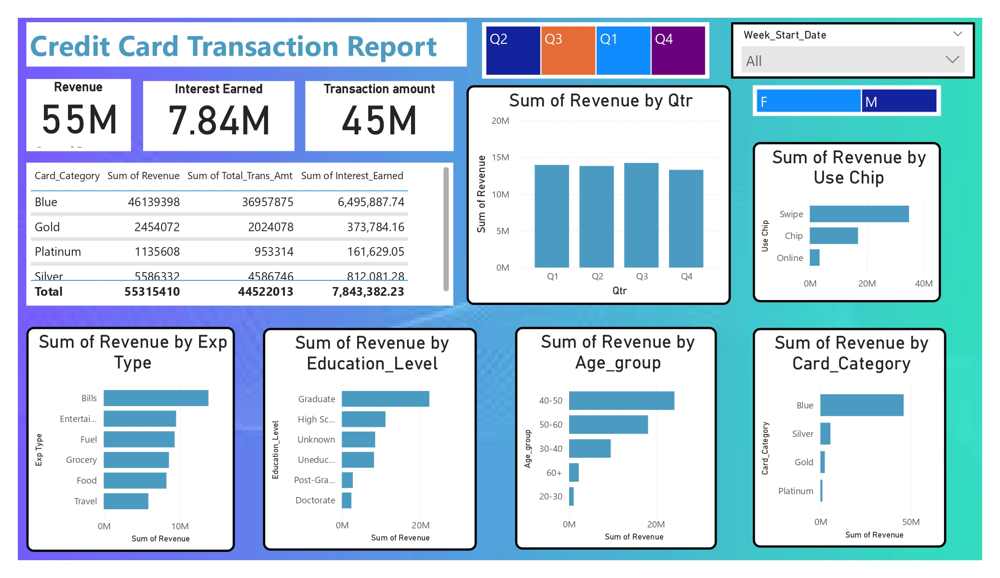
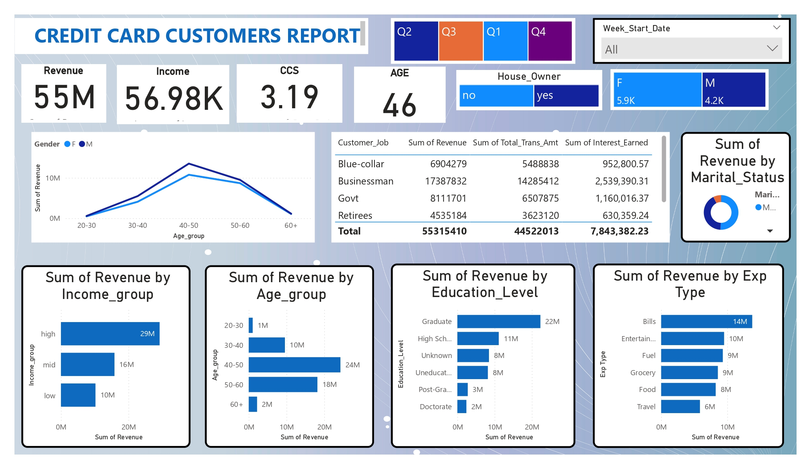

# 💳 Credit Card Financial Dashboard

An end-to-end Business Intelligence project built using **SQL**, **MySQL**, and **Power BI** to analyze credit card transactions, customer behavior, revenue generation, and operational performance.

The dashboard provides weekly and yearly insights into key business metrics, helping stakeholders monitor performance trends, customer engagement, transaction activity, and credit card portfolio health.

---

## 📌 Project Objective

To develop an interactive Credit Card Financial Dashboard that delivers real-time insights into:

- Revenue performance
- Transaction trends
- Customer demographics
- Card category performance
- Activation and delinquency rates
- Week-over-Week (WoW) business growth

The dashboard enables data-driven decision-making through intuitive visualizations and KPI tracking. :contentReference[oaicite:1]{index=1}

---

## 🛠️ Tech Stack

| Tool | Purpose |
|--------|----------|
| SQL / MySQL | Data Storage & Querying |
| Power BI | Dashboard Development |
| Power Query | Data Transformation |
| DAX | KPI Calculations & Measures |
| Excel / CSV | Data Source |

---

## 📂 Repository Structure

```
├── Datasets/
│   ├── credit_card.csv
│   ├── customer.csv
│
├── SQL Query - Financial Dashboard Data.sql
├── Credit_Card_Financial_Dashboard.pbix
├── Credit Card Financial Weekly Dashboard Report.pdf
├── Dashboard Screenshots/
└── README.md
```

---

## 🔄 Project Workflow

### 1. Data Preparation
- Collected customer and transaction datasets.
- Performed data cleaning and validation.
- Added weekly incremental data for reporting updates.

### 2. Database Creation
- Created database schema in MySQL.
- Imported CSV files into SQL tables.
- Established relationships between customer and transaction tables.

### 3. Data Modeling
- Connected MySQL database to Power BI.
- Built star schema relationships.
- Optimized model for reporting.

### 4. Data Transformation
- Processed data using Power Query.
- Removed inconsistencies and duplicates.
- Created calculated columns.

### 5. DAX Calculations
Developed measures for:
- Revenue
- Interest Earned
- Transaction Amount
- Transaction Count
- Customer Count
- Activation Rate
- Delinquency Rate
- Week-over-Week Growth

### 6. Dashboard Development
Created interactive dashboards for:
- Transaction Analysis
- Customer Analysis
- Revenue Tracking
- Regional Performance
- Card Category Analysis

---

# 📊 Dashboard Pages

## Transaction Dashboard

Key metrics:
- Total Revenue
- Total Transaction Amount
- Transaction Count
- Interest Earned
- Revenue Trend Analysis
- Card Category Performance
- State-wise Contribution

### Insights Included
- Weekly transaction growth
- Revenue contribution by card type
- Geographic transaction distribution
- Customer spending patterns

---

## Customer Dashboard

Key metrics:
- Customer Count
- Revenue by Gender
- Revenue by Age Group
- Customer Segmentation
- Activation Rate
- Delinquency Rate

### Insights Included
- Demographic analysis
- High-value customer segments
- Customer acquisition trends
- Credit card usage behavior

---

# 📈 Key Business KPIs

| KPI | Description |
|-------|-------------|
| Revenue | Total income generated |
| Interest Earned | Interest collected from customers |
| Transaction Amount | Total spending amount |
| Transaction Count | Number of transactions |
| Customer Count | Active customers |
| Activation Rate | Percentage of activated cards |
| Delinquency Rate | Percentage of overdue accounts |

---

# 📉 Sample Business Insights

### Week-over-Week Performance
- Revenue growth tracking
- Transaction volume analysis
- Customer acquisition trends
- Spending behavior changes

### Year-to-Date Analysis
- Revenue contribution by customer demographics
- Card category performance comparison
- State-wise revenue distribution
- Customer activation and delinquency monitoring

---

## 🚀 How to Run the Project

### Prerequisites
- Power BI Desktop
- MySQL Server
- MySQL Workbench

### Steps

1. Clone the repository

```bash
git clone https://github.com/your-username/Credit_Card_Financial_Dashboard.git
```

2. Create the database using:

```sql
SQL Query - Financial Dashboard Data.sql
```

3. Import datasets into MySQL.

4. Open:

```text
Credit_Card_Financial_Dashboard.pbix
```

5. Update database connection credentials if required.

6. Refresh the dashboard.

---

## 📸 Dashboard Preview

### Transaction Dashboard


### Customer Dashboard



---

## 🎯 Business Value

This project demonstrates:

- End-to-end BI solution development
- SQL-based data integration
- Power BI dashboard design
- DAX measure creation
- Customer analytics
- Financial performance reporting
- KPI-driven decision making

---

## 📚 Skills Demonstrated

- SQL
- MySQL
- Power BI
- DAX
- Data Modeling
- ETL
- Data Visualization
- Business Analytics
- Dashboard Design

---
